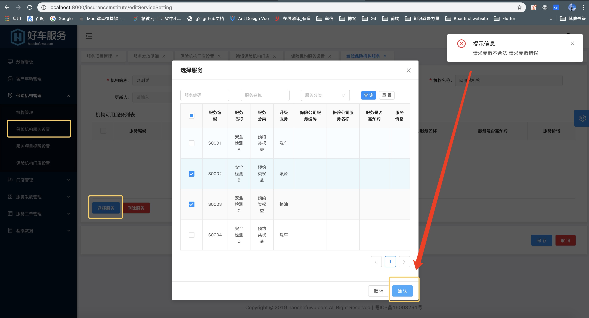

## 运营端问题汇总

运营端内网测试环境地址：[10.0.10.225:85](10.0.10.225:85)

请求地址：http://10.0.10.107:8002/gw

### 问题一

保险机构管理-保险机构服务设置-编辑按钮

选择服务按钮-勾选服务后点击确认，接口提示“请求参数不合法”

接口：801000130004

### 问题二

保险机构管理-服务项目提醒设置

1. 对于列表来说，缺少了很多的字段，比如【机构名称】、【保险公司服务编码】等。

2. 点击编辑进去，在启用一些【服务项目提醒设置】，比如启用了第一个【服务消费提醒】，然后点击保存，虽然接口提示成功了，但是再次进来还是没有成功。

保存的接口为：801000140002

并且我认为该接口的参数有些不正确，因为它只要我传递了`orgCode`、`itemCode`，但是并没有要我传服务项目提醒的`id`，需要后台排查一下是否是这个原因导致的修改失败

### 问题三

保险机构管理-保险机构门店设置-编辑按钮

1. 选择门店点击保存时提示：参数错误

2. 勾选了服务之后点击删除服务：参数错误

### 问题四

门店管理-门店管理-编辑

联系人手机号一直保存不了

接口：801000170004

手机号参数：phoneNo

### 问题五

门店管理-门店服务项目设置-编辑

选择服务保存之后，提示：请求参数不合法

接口：801000170008

